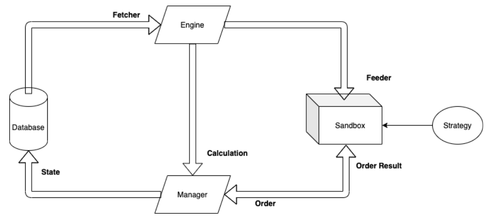

# QEF-Backtesting-System
  


  

#### This is a Quantitative Evaluation Framework written in Python. Traders can gain insight into the effectiveness of an idea without risking funds in trading accounts through the QEF-Backtesting system.    
   
## Prerequisites   
1. Fork or clone the repository.   
   

2. Downloads the data provided in the QEF shared folders and rename it as *raw_data*. The folder structure is provided in the following for clarification.   

```
.
|
|--- raw_data
|   |--- mapping.csv
|   |--- pricevol.csv
|
|--- Util
    |--- data-processing.py
```   
  
## Preliminary Setup 
1. You are advised to install Python dependencies as listed. But you can also maintain dependencies on your own.   

```
pip3 install -r dependency.txt
```
or  
```
python3 -m pip install -r dependency.txt
```
   
2. Run the *data-procesing_0050.py* (or other data-processing python script) to process the *raw_data* and store them into *Dataset*. Remeber to execute it under the folder *Util*.
```
cd Util
python3 data-processing_0050.py
```   
  
## Run Main Program
1. To run the main program, you have to first local in *QEF-Backtesting-System* folder.  

2. The usage of the main program:  
```
python3 main.py --start-date START_DATE --end-date END_DATE  
               --strategy_file STRATEGY_FILE --universe_file UNIVERSE_FILE  
               [--save_file SAVE_FILE]  
``` 
  
The (optional) arguments are explained as following:  
```  
-h, --help
        show this help message and exit  
  
--start-date START_DATE  
        Backtesting Strating Time, fromat: YYYY-mm-dd  
  
--end-date END_DATE     
        Backtesting Ending Time, fromat: YYYY-mm-dd  
      
--strategy_file STRATEGY_FILE
        Backtesting Strategy File Name (withou .py)

--universe_file UNIVERSE_FILE  
        Backtesting Universe Path Name  

--save_file SAVE_FILE
        The root repository to store your result in historicla_strategy
```  
  
For example, you can use the following command to see the result of the given duration with strategy and universe. 
``` 
python3 main.py --start-date 2019-01-01 --end-date 2019-3-31 --strategy_file mean_reversal --universe_file Taiwan_50
```
   
3. The result will be stored in *historical_strategy* file with default file name the time of execution. Also, the *images*, *args.txt*, *strategy*, and *ratio.csv* are store to examine the result.  
  
## Strategy Development  
To develope a new strategy, you basically need to create a file with a **Strategy** class. The rules a deliberate on following context.  

1. The strategy file must to have the following structure:
```  
# Strategy class  
class Strategy:  
  
    # Main trading function  
    def trade(
        self, data: pd.DataFrame, holding: Holding, fiat: float, current_date: dt.date
    ) -> OrderBook:  

        return newOrderBook
```
2. The Engine will call **Strategy.trade** and pass in current price volume data, current holding, current fiat possessions, and current date.  
  
3. The price volume data is passed in as a *pd.Dataframe* as following:  
```
>> df.head(5)

                          id identifier exchange                     date_  \
__null_dask_index__                                                          
0                    2866446       0050       TW 2020-01-08 00:00:00+00:00   
1                    3015756       1101       TW 2020-01-08 00:00:00+00:00   
2                    3026328       1102       TW 2020-01-08 00:00:00+00:00   
3                    3100755       1216       TW 2020-01-08 00:00:00+00:00   
4                    3192801       1301       TW 2020-01-08 00:00:00+00:00   

                      high_    low_   open_  close_      volume_  adj_close_  \
__null_dask_index__                                                            
0                     96.20   95.05   95.20   95.65   8516995.00     91.9717   
1                     43.55   43.15   43.15   43.40  14112923.38     38.9986   
2                     48.55   47.85   47.90   48.55   7750971.00     45.4042   
3                     73.40   72.60   73.40   72.60   5159215.00     70.0328   
4                    101.50  100.00  101.50  100.00   4670180.00     94.9772   

                     is_backfill                     db_timestamp  
__null_dask_index__                                                
0                           True 2021-01-03 03:24:00.830558+00:00  
1                           True 2021-01-03 03:25:44.288406+00:00  
2                           True 2021-01-03 03:25:46.498593+00:00  
3                           True 2021-01-03 03:26:06.165567+00:00  
4                           True 2021-01-03 03:26:31.129308+00:00  
```
   
4. The trade function will return the *OrderBook* and the system will handle the rest.  
  
## Universe Development  
There are mainly two ways to develop the universe. 
1. Completely rewrites the *data-processing.py* and make sure to store the result in *Dataset/Universe* file.  
2. The second ways is to gather the ticker of your universe and then put it in *Util/parameters.py*. Then, import them in *data-processing.py*. 
  
## Additional Information
The main structure is represent as below:  
   
  
